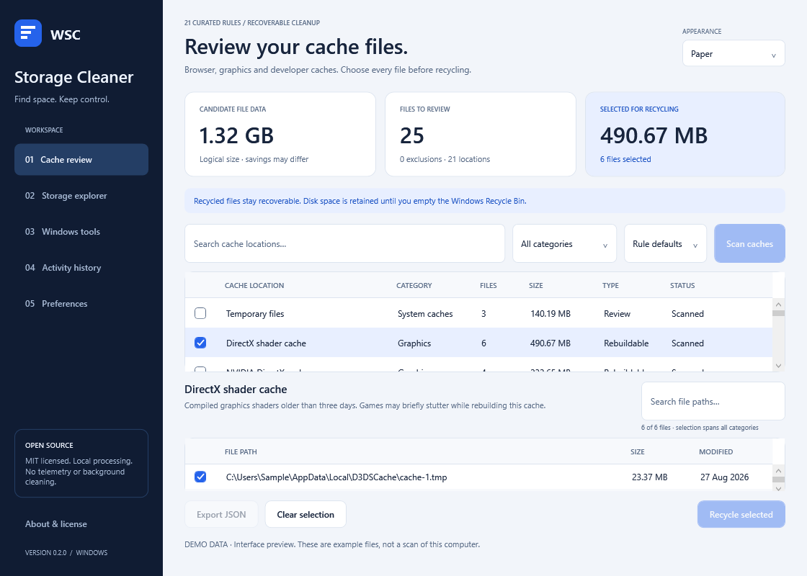
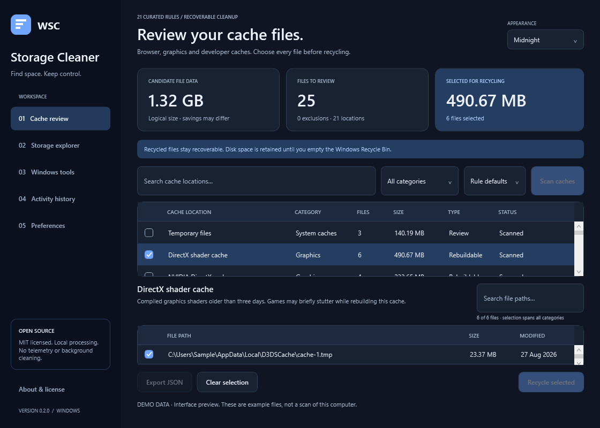

# Windows Storage Cleaner

[](https://github.com/tHEtRICKsTER-N/Windows-Storage-Cleaner/actions/workflows/ci.yml)

An MIT-licensed Windows desktop app for reviewing cache files, understanding storage use, and running supported Windows maintenance.



**Release 0.2.0 · Windows x64 · .NET 10 / WPF · No telemetry**

## Install

Download v0.2.0: [Setup installer](https://github.com/tHEtRICKsTER-N/Windows-Storage-Cleaner/releases/download/v0.2.0/WindowsStorageCleaner-0.2.0-Setup-x64.exe) · [Portable ZIP](https://github.com/tHEtRICKsTER-N/Windows-Storage-Cleaner/releases/download/v0.2.0/WindowsStorageCleaner-0.2.0-win-x64.zip) · [SHA-256 checksums](https://github.com/tHEtRICKsTER-N/Windows-Storage-Cleaner/releases/download/v0.2.0/SHA256SUMS.txt)

Use `WindowsStorageCleaner-0.2.0-Setup-x64.exe` for a per-user installation with Start menu shortcuts and an uninstaller. Administrator permission is not needed for setup or cache review. The installer bundles .NET.

For portable use, extract the entire `WindowsStorageCleaner-0.2.0-win-x64.zip` and run `WindowsStorageCleaner.exe`. Keep its DLLs, runtime files, and maintenance helper together. Portable mode still stores preferences and cleanup journals under `%LOCALAPPDATA%\WindowsStorageCleaner`.

Windows 11 x64 is the primary target. Windows 10 compatibility depends on the edition and .NET's current [supported Windows versions](https://learn.microsoft.com/dotnet/core/install/windows); it has not been tested across editions. Native ARM64 and x86 packages are not provided.

Release binaries are **unsigned**. Check `SHA256SUMS.txt` before installation. Windows may show an unknown-publisher prompt.

## Features

| Area | Included |
| --- | --- |
| Cache review | 21 narrow rules, per-file and category selection, search, category filters, JSON export |
| Browsers | Chrome, Edge and Brave default-profile cache roots; credentials, cookies, bookmarks and history stay outside the rules |
| Other caches | User temporary files, DirectX/NVIDIA/AMD shaders, npm, pip, NuGet HTTP cache, Explorer thumbnail/icon cache and archived error reports |
| Preferences | Folder exclusions; rule defaults or stricter 14/30/90-day age threshold |
| Storage explorer | Large files in a chosen local folder; optional SHA-256 identical-content groups; JSON export |
| Appearance | Paper, Midnight, Evergreen, Amethyst and System appearance |
| History | Local per-file cache recycling journals, interrupted-run status and links to the Windows Recycle Bin |
| Windows tools | Component-store analysis/cleanup, Delivery Optimization cache cleanup, reduce/disable/restore hibernation |
| CLI | Read-only scans, rule listing and storage analysis |



## How cleanup works

1. Scan. The app starts with nothing selected.
2. Review cache explanations and individual paths. Close applications that use those caches.
3. Select files or categories and confirm. The confirmation includes selections hidden by filters.
4. Eligible files move to the **Windows Recycle Bin**. Restore them there if needed.

**Recycling does not immediately reclaim space.** Recycled data continues occupying disk until you empty the Windows Recycle Bin. The app reports logical candidate/recycled sizes and reports zero bytes reclaimed by recycling. It does not empty the bin automatically.

The scanner excludes recent, locked, read-only, protected, offline, encrypted and hard-linked files and does not follow junctions or symbolic links. Cleanup checks file identity, size and timestamps again, holds parent directory leases, creates a journal before mutation, and refuses Windows Shell's permanent-delete fallback. Changed files are skipped. See [security and limitations](SECURITY.md).

Cache removal can cause re-downloads, shader compilation or lost diagnostics. Temporary files and archived error reports require review. Browser support covers the default profile only. Explorer may lock its caches, which are then skipped.

Storage analysis is advisory and has no delete action. Identical content does not establish that a copy is disposable. Analysis stops at 200,000 examined files, stores up to 10,000 size-qualified candidates, and displays the largest 500 of those. Duplicate hashing considers only size-qualified candidates, skips files larger than 512 MiB, and has a 2 GiB total successful-hash budget. Limited/cancelled reports are partial.

## Advanced Windows maintenance

The main app runs without elevation. Selecting a Windows operation opens a separate helper through UAC. A second confirmation precedes operations that change the system; component-store analysis is read-only.

- DISM servicing handles component-store cleanup. WinSxS is never deleted directly and `/ResetBase` is never used.
- The official Delivery Optimization cmdlet clears download cache while retaining pinned downloads.
- Reduced hibernation retains Fast Startup but disables full hibernation and hybrid sleep.
- Disabling hibernation disables those features and Fast Startup. The restore operation enables full hibernation again.
- Operations may be unavailable under a device's Windows configuration or policy. Once started, Windows maintenance cannot be safely cancelled in this app. Review helper output; it is separate from cache recycling journals.

The app also links to Windows Storage settings, Disk Cleanup and System Protection. There is no registry cleaning, arbitrary elevated scripting, automatic duplicate removal, background cleanup or direct deletion of Windows Update databases.

## CLI

```powershell
.\cleaner.exe rules
.\cleaner.exe scan --dry-run --min-age 30 --exclude "$env:LOCALAPPDATA\Temp" --json
.\cleaner.exe analyze "$env:USERPROFILE\Downloads" --duplicates --min-mb 50 --output analysis.json
```

All CLI commands are read-only. Repeated `--exclude` options are supported for cache scans. `--output` creates a new file and refuses to overwrite one. Ctrl+C cancels; exit code 130 means partial results. Reports and journals contain local paths: review them before sharing.

## Build and test

Install the [.NET 10 SDK](https://dotnet.microsoft.com/download/dotnet/10.0) on Windows.

```powershell
.\scripts\test.ps1
dotnet run --project src/Cleaner.App
```

There are no third-party NuGet package references. `NuGet.Config` disables package feeds for ordinary builds. Self-contained publishing explicitly uses NuGet.org for official Microsoft runtime packs.

```powershell
.\scripts\get-inno.ps1
.\scripts\release.ps1
```

The release script builds/tests, publishes x64 GUI/CLI/helper with .NET, compiles the per-user setup using pinned Inno Setup 6.7.3, writes a portable ZIP and SHA-256 checksums. See [release instructions](docs/RELEASING.md).

## GitHub and contributing

The source is hosted at [tHEtRICKsTER-N/Windows-Storage-Cleaner](https://github.com/tHEtRICKsTER-N/Windows-Storage-Cleaner). The repository includes Windows CI, draft tag-release automation, issue templates, a pull request template and dependency updates for Actions. The tag workflow prepares a **draft** release for review.

Read [CONTRIBUTING.md](CONTRIBUTING.md), [CODE_OF_CONDUCT.md](CODE_OF_CONDUCT.md), [SECURITY.md](SECURITY.md), and [CHANGELOG.md](CHANGELOG.md).

The source and original artwork are under [MIT](LICENSE). Bundled .NET components retain their own licenses; see [THIRD_PARTY_NOTICES.md](THIRD_PARTY_NOTICES.md).
